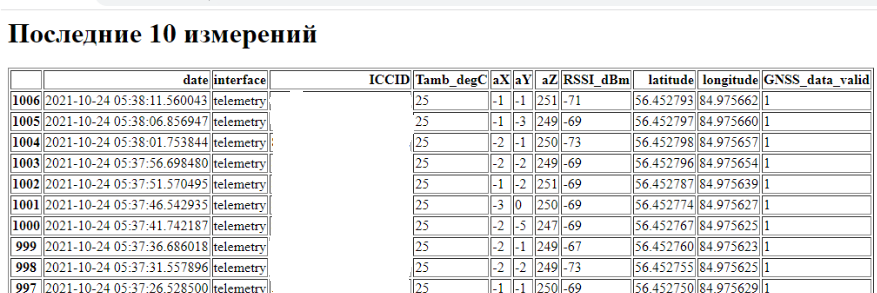
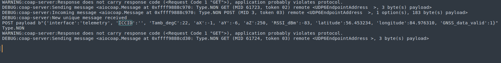

# NB-IoT-MTS


## change configs:

```shell
cp config.json.dist config.json
cp docker/.env.dist docker/.env
```

## install docker and docker-compose (using Ubuntu 18.04)

```shell
# install docker
sudo apt install ca-certificates curl gnupg lsb-release
curl -fsSL https://download.docker.com/linux/ubuntu/gpg | sudo gpg --dearmor -o /usr/share/keyrings/docker-archive-keyring.gpg
echo \
  "deb [arch=$(dpkg --print-architecture) signed-by=/usr/share/keyrings/docker-archive-keyring.gpg] https://download.docker.com/linux/ubuntu \
  $(lsb_release -cs) stable" | sudo tee /etc/apt/sources.list.d/docker.list > /dev/null
sudo apt update
sudo apt-get install docker-ce docker-ce-cli containerd.io
sudo usermod -aG docker $USER

# install docker-compose
sudo curl -L "https://github.com/docker/compose/releases/download/v2.0.1/docker-compose-$(uname -s)-$(uname -m)" -o /usr/local/bin/docker-compose
sudo chmod +x /usr/local/bin/docker-compose
```

## run docker-compose:

```shell
cd docker && docker-compose up -d 
```

## see results on web:



## example logs from CoAP:




## Да, я слышал про контейнеры. Не думал что разработчики работают в порту.

